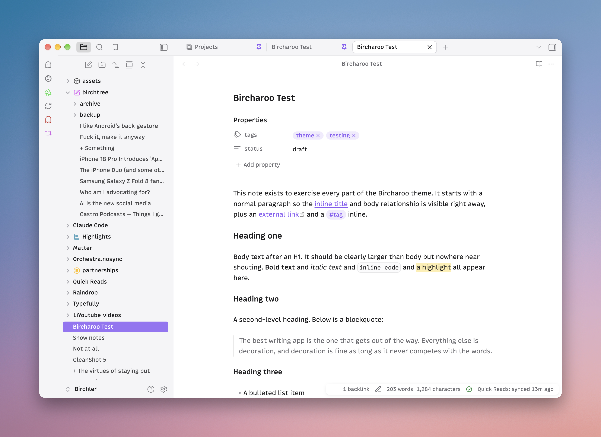
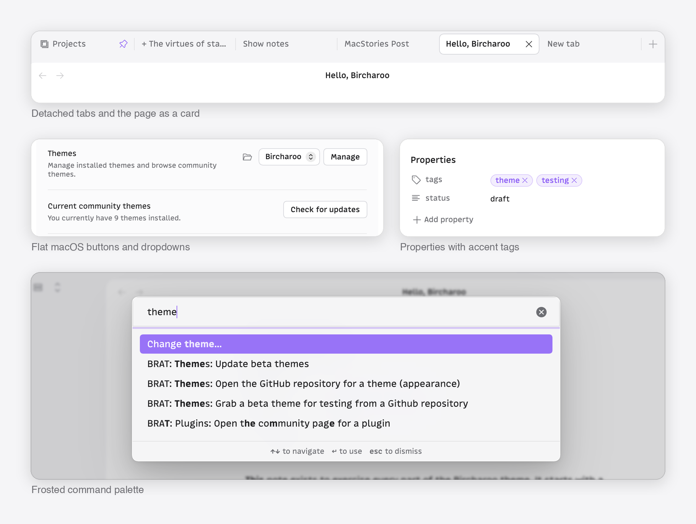

# Bircharoo

A calm Obsidian theme built for writing.





Bircharoo keeps the page front and center and quiets everything around it. It uses
whatever fonts you set in Appearance and tunes size, weight, and spacing so they read
well. Headings step down in size, but the document title is only a touch larger than
body text, so a note never shouts.

## What you get

- **A calm writing surface.** Generous line height, a readable measure, links and
  tags in your accent color, headings that stay neutral.
- **Quiet chrome.** The note sits as a rounded card inside a soft gray frame.
  Tabs, buttons, dropdowns, and the file explorer are restyled to match it, and the
  selected file takes your accent color while the sidebar has focus.
- **Glass where it counts.** Menus, the command palette, suggestions, modals,
  hover previews, and notices are frosted. Chrome that never moves stays solid.
- **Tactile controls.** Buttons press, icons respond, toggles ease, checkboxes
  spring. Motion is short and switches off under Reduce Motion.
- **Phosphor icons** in place of the stock set, drawn in your accent and text
  colors.
- **Every part of a note.** Tables with hairline rows and lined-up figures, images
  with the embed's corners and a caption when you give one, footnotes as small
  accent markers, code blocks with a copy button that fades in, callouts, embeds as
  soft inset cards, and a quiet properties block.
- **Typographic craft.** Headings wrap to balanced lines, paragraphs never strand a
  last word, and counts use tabular numerals so nothing jumps.
- **Print and PDF export** come out as white paper and black ink, with the screen
  furniture gone.
- **Native manners.** The chrome goes quiet when another window has focus, and the
  graph and canvas take the same neutrals as the page.
- **Plugins.** Bases, Dataview, Tasks, Calendar, Kanban, Projects, Omnisearch, and
  Hover Editor look like they came with the theme.
- **Light and dark**, designed as equals. Dark is a warm neutral gray, never pure
  black.
- **iPhone and iPad** carry the same type scale and glass surfaces.

## Options

Bircharoo is opinionated first, but a few choices are yours. Install the
[Style Settings](https://github.com/mgmeyers/obsidian-style-settings) plugin and
look under Settings > Style Settings > Bircharoo:

- **Flat page**: no rounded card, the note fills its pane.
- **Solid surfaces**: no frosted glass.
- **Use Obsidian's icons**: keep Lucide instead of Phosphor.
- **Selected file keeps the accent** after you click into the editor.
- **Larger headings**: a wider type scale.
- **Focus mode while typing**: everything but the paragraph you are on fades back.

## Tips

- Set your accent color in Settings > Appearance. The theme follows it everywhere:
  links, tags, selection, focus rings, the selected file.
- Bircharoo ships no fonts. Pick any interface and text font you like.

## Development

Symlinked theme folders are ignored by Obsidian, so use the install script, which
copies the files into a vault and reloads the theme through the Obsidian CLI:

```sh
scripts/install.sh            # installs into ~/Obsidian/Birchler-alt (the dev vault)
scripts/install.sh /path/to/vault
scripts/watch.sh              # reinstall on every save
scripts/screenshots.sh        # capture the test note in every mode for diffing
```

- `theme.css`: the whole theme. Variables first, then component rules, then mobile,
  then a generated block that swaps Obsidian's Lucide icons for Phosphor.
- `scripts/icons.json` and `scripts/build-icons.py`: the icon mapping and the
  generator. Phosphor glyphs used are vendored in `assets/phosphor/`.
- `test/Bircharoo Test.md`: a kitchen-sink note for checking every element:
  headings, lists, tasks, tables, images, footnotes, code, callouts, embeds, math.
- `scripts/screenshots.sh`: captures that note in light and dark, reading and
  editing, every scrolled page, and a phone-width window, for before-and-after
  diffs. Needs Obsidian running with the dev vault open.
- [DESIGN.md](DESIGN.md): the brief and the reasoning behind the choices.

## Credits and license

Bircharoo is MIT licensed. Icons are [Phosphor Icons](https://phosphoricons.com),
also MIT licensed.
