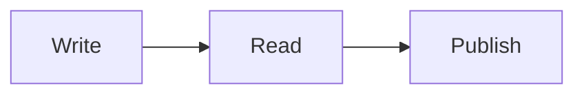

This note exists to exercise every part of the Bircharoo theme. It starts with a normal paragraph so the [[Bircharoo Test|inline title]] and body relationship is visible right away, plus an [external link](https://birchtree.me) and a #tag inline. It also carries a footnote[^1] and a second one[^note] a little later.

# Heading one

Body text after an H1. It should be clearly larger than body but nowhere near shouting. **Bold text** and *italic text* and `inline code` and ==a highlight== and ~~struck text~~ all appear here. A comment %%hidden in reading view%% sits in this sentence, and so does a <kbd>Cmd</kbd>+<kbd>P</kbd> key combination.

## Heading two

A second-level heading. Below is a blockquote:

> The best writing app is the one that gets out of the way. Everything else is decoration, and decoration is fine as long as it never competes with the words.

An image with a caption, then one without:

![[Bircharoo Test.png|The theme, photographed by itself]]

![[Bircharoo Test.png]]

### Heading three

- A bulleted list item
- Another item with a [[wikilink]] and an [[unresolved link]]
    - A nested item
        - Nested one more level
- [ ] An open task
- [x] A completed task
    - [ ] A nested task

#### Heading four

1. First numbered item
2. Second numbered item
3. Third numbered item

##### Heading five

```swift
struct Theme {
    let name = "Bircharoo"
    var isPremium: Bool { true }
}
```

A longer block, to check the copy button and the language label:

```js
// A small function with a comment
export function greet(name = "world") {
  const message = `Hello, ${name}!`;
  return message.length > 12 ? message : message.toUpperCase();
}
```

###### Heading six

A table with figures, so numerals and alignment can be checked:

| Item | Words | Share | Notes |
| --- | ---: | ---: | --- |
| Long-form posts | 12,480 | 61.2% | Most of the vault |
| Highlights | 4,105 | 20.1% | Imported |
| Show notes | 2,311 | 11.3% | Weekly |
| Everything else | 1,507 | 7.4% | Loose notes and drafts |

> [!note] A callout
> Callouts should feel soft and rounded.

> [!tip] A tip
> With a different color.

> [!warning]- A collapsed warning
> This one starts folded.

An embedded section of this same note:

![[Bircharoo Test#Colophon]]

Inline math $E = mc^2$ and a block:

$$
\int_0^1 x^2 \, dx = \frac{1}{3}
$$



---

A final paragraph after a horizontal rule. #another-tag

## Colophon

A short closing section, kept small so it can be embedded above without
dragging the whole note along with it.

[^1]: The first footnote, short and sweet.
[^note]: A named footnote with a [link](https://birchtree.me) in it, long enough to wrap onto a second line when the column is narrow.
